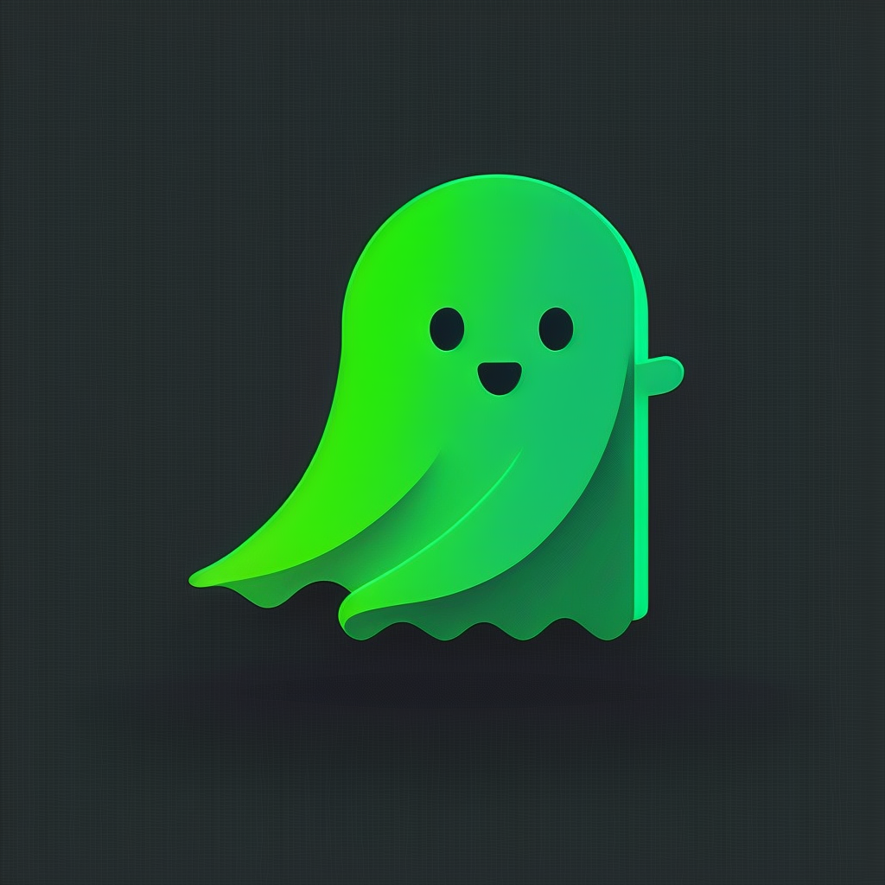

## Ghostwallet: By ZombieDAO

*Ghostwallet*: By ZombieDAO is a powerful and effective open-source privacy wallet on the Cardano blockchain. It will be the first cross-chain wallet to be compatible with both the Cardano blockchain and the Midnight Sidechain, allowing for greater flexibility and security in managing your digital assets.  *Ghostwallet* will be compliant with relevant privacy regulations, and is resistant to side-channel attacks, ensuring that your information remains private and secure.  The open-source nature of the wallet allows for community contributions and ongoing maintenance, ensuring that it remains up-to-date and relevant. 

*Ghostwallet* offers users a simple and easy-to-use solution for managing their transactions, decentralized IDs, verified credentials, and other personal information in a private and secure manner. Privacy is a human right, and *Ghostwallet* ensures that your personal information remains private and secure, even when making transactions. *Ghostwallet* allows users to selectively disclose their transaction history with complete control. Simply share a "view key" with those who need to see specific transactions, and rest assured that your personal information remains private and secure. You are in control of your own privacy, and *Ghostwallet* makes it easy to comply with legal requirements while keeping your information safe. *Ghostwallet* is a valuable tool for protecting your privacy on the blockchain. Show your support for *Ghostwallet* and join the movement for secure and private transactions. 

We are currently seeking developers who are interested in contributing to the *Ghostwallet* project. If you are a developer with experience in blockchain technology and a passion for protecting privacy, please get in touch. Join the ZombieDAO *Ghostwallet* team and help us build a better future for privacy on the blockchain.
